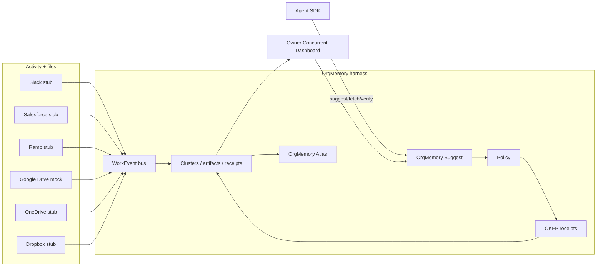

# OrgMemory

**Official memory for agentic teams.**

Weave was an internal codename. The public product name is **OrgMemory**. Retired aliases: Agentic Cloud Storage · LedgerFS.

OrgMemory is an **organizational agent harness**. It holds the org’s data/work graph (`Actor`, `Artifact`, `WorkEvent`, `WorkCluster`, `Stage`, `Receipt`), adapts per tenant (connectors, ranking, policy, license), and **drives the web UI**. The Owner Concurrent Dashboard is a live projection of concurrent work — department × team × stage — not a chat wrapper.

Activity is multi-platform: Slack, Salesforce, Ramp, Google Drive, OneDrive, Dropbox, and Seal all normalize onto the same bus. File overlay still matters (midnight suggest/fetch without waking a partner). Cloud storage is a source, not the product identity.

See `docs/HARNESS.md`, `docs/CONCURRENT_FABRIC.md`, `docs/HERMES_RUNTIME.md`, and `docs/DEMO.md`. Public shareable walk (not the live API): https://orgmemory-demo.vercel.app — waitlist https://orgmemory-waitlist.vercel.app.

## One-liner

Official memory for agentic teams — the harness behind concurrent work, and the right file at 00:30, without waking a human, with an OKFP receipt.

## Packaging (SaaS + OEM)

| Layer | What ships | Status in v0 |
| --- | --- | --- |
| **Hosted Hermes runtime** | Tenant agent loops (suggest/fetch/tools/prompt-trace) on OrgMemory infra | Implemented (deterministic; worker stub) |
| **OrgMemory Suggest** | Multi-tenant org/projects, mock Drive + OD/DB stubs, overlay index, Midnight ranking, agent API | Implemented |
| **OrgMemory Atlas** | Provenance skill graph, top reused docs, nascent skill nodes | Implemented (seed graph; not HR grading) |
| **OrgMemory Seal** | OKFP receipts, verify, employee-visible ledger, **Win+Mac+Linux** endpoint events (T0–T3) | Implemented (native watchers are scaffolds; ingest + schema tested) |
| **OrgMemory License** | Signed JWT for on-prem/OEM feature flags (`suggest`, `receipts`, `atlas`) | Stub server + real HMAC JWT check |

Cloud subscription is the default. OEM / on-prem presents `ORGMEMORY_LICENSE_TOKEN`. See `biz/PRICING_DRAFT.md` and `apps/license`.

## Who it is for

| Actor | Job to be done |
| --- | --- |
| Owner | Watch concurrent clusters (stage, artifacts, events) without a surveillance product. |
| Associate / IC | Find the executed rent schedule at midnight without guessing filenames or pinging a partner. |
| Agent | `suggest` → `fetch` → `verifyReceipt` via `@orgmemory/sdk`. Never touch a colleague's laptop. |
| Manager | See what knowledge was reused, by whom, for what purpose — OrgMemory Seal, not a keylogger. |
| Security / GC | Enrollment, ACL inheritance, purpose binding, receipts, retention hooks. |

**ICP:** professional services firms, 20–200 seats.

## P0 — this repo

- Harness objects + activity bus (`docs/HARNESS.md`)
- Owner Concurrent Dashboard (department / team / stage + cluster brainstorm)
- Activity connectors with a real normalize interface: Slack, Salesforce, Ramp (stubs) + Drive mock + OD/DB/Seal
- Multi-tenant Org + Project + project membership
- Google Drive **mock provider** (metadata + content sync; OAuth later)
- OneDrive / Dropbox stubs; Linux FS documented, unenrolled
- SQLite overlay index (`pnpm dev`); optional Postgres compose file
- Pluggable embeddings (deterministic local-hash default)
- `POST /v1/suggest` — Midnight ranking with why-scores
- `POST /v1/fetch` — purpose required, policy, audit, OKFP receipt
- `GET /v1/audit`, `GET /v1/receipts/:id`, `POST /v1/receipts/verify`
- `GET /v1/atlas` — skill graph
- Hosted Hermes runtime: `packages/harness-runtime`, `GET/POST /v1/runtime`, `apps/worker` (`docs/HERMES_RUNTIME.md`)
- Concurrent fabric: mirrors, rollback, hard commits, session vault, Composio tenant mock, prompt bus
- Dashboard: Owner Concurrent Dashboard, Console, OrgMemory Suggest, OrgMemory Seal, OrgMemory Atlas
- Seed: **Acme Legal**, lease corpus
- Agent SDK + policy package + license hook

## P1

- Linux workstation agent (`docs/future/linux-fs-agent.md`, `docs/SEAL_ENDPOINTS.md`)
- Real OAuth connectors
- Policy engine vocabularies / retention classes
- Output-vs-time (draft velocity vs reuse)

## P2

- HR grading workflows (explicit policy only — not dark surveillance)
- Connector marketplace
- Offline CRDT for the Linux agent
- Real embedding providers (OpenAI / Voyage)

## Trust (non-negotiable)

| Principle | Product meaning |
| --- | --- |
| Overlay | Canonical files stay in Drive / OneDrive / Dropbox |
| Enrollment | No silent personal-drive scraping |
| ACL inheritance | `ownerId` + `sharedWith[]`; suggest/fetch honor it |
| Purpose binding | No purpose, no bytes |
| Employee-visible | People see events that name them |
| No keylogging | Out of scope forever |
| Agent identity | Midnight fetches are attributed as agents |
| Matter wall | Stub: matter-granted actors only |

## Architecture (this monorepo)

## Success for v0

- Owner Concurrent Dashboard shows seeded Slack / Salesforce / Ramp / Drive clusters
- `pnpm install && pnpm dev` boots API + dashboard
- Seeded suggest for “lease rent schedule” returns ranked lease docs
- Fetch issues an OKFP receipt that verifies
- Every fetch (and every deny) creates an audit row
- README explains the midnight agent path
